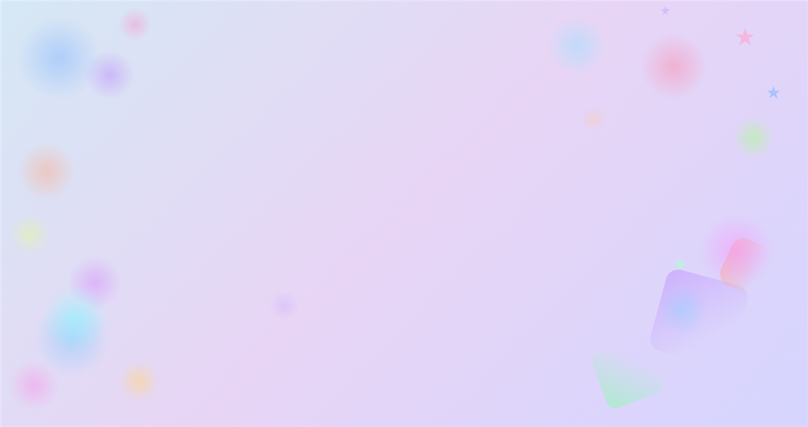
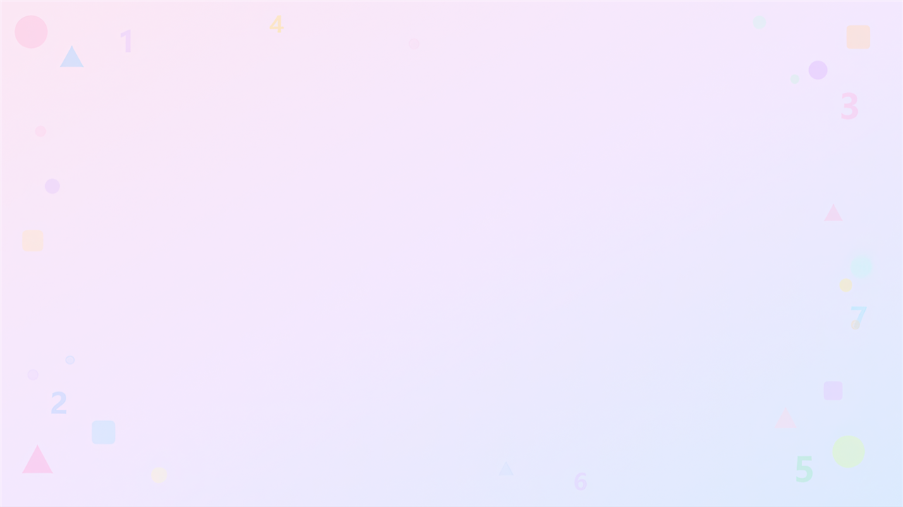
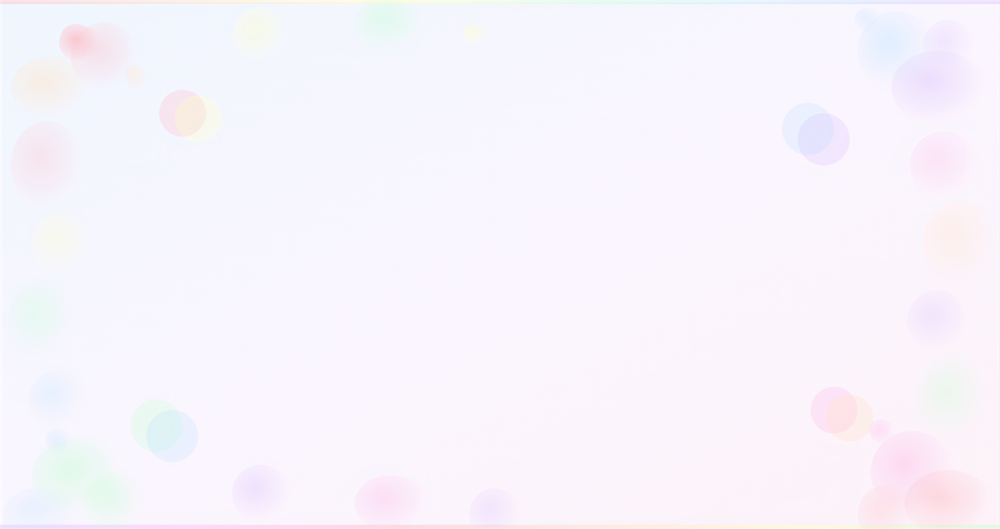
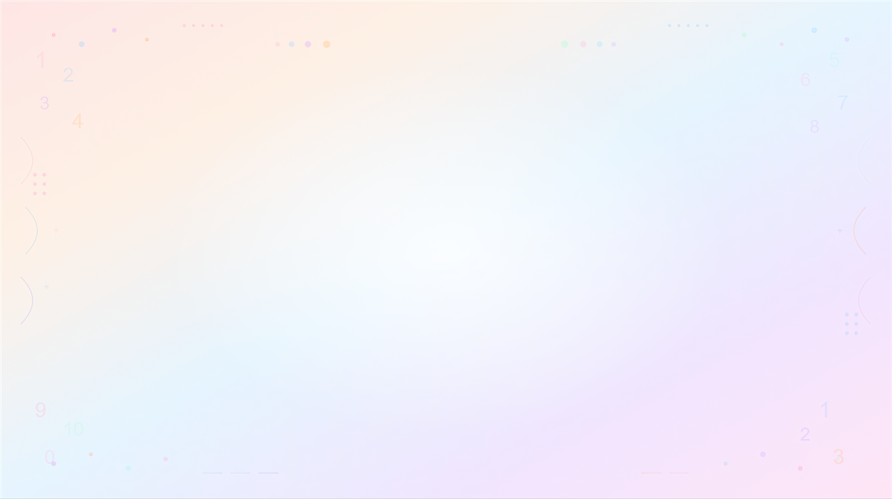

# Adaptive Learning Game (2D)

[](https://unity.com/)
[](https://docs.microsoft.com/en-us/dotnet/csharp/)
[](#лицензия)

Обучающая 2D-игра для развития когнитивных навыков (внимание, память, логика), разработанная в рамках магистерской диссертации.

> **Release:** [v1.0-thesis](https://github.com/dvllvsberg/Adaptive-Learning-Game/releases/tag/v1.0-thesis) — Windows build для быстрого запуска без Unity.

## Скриншоты

| Главное меню | Выбор раздела |
|---|---|
|  |  |

| Раздел «Цвета» | Раздел «Фигуры» | Раздел «Числа» |
|---|---|---|
|  |  |  |

## О проекте

Игра построена на модульной структуре:

- **Разделы:** цвета, фигуры, числа
- **Мини-игры** внутри каждого раздела
- **Уровни** с постепенным ростом сложности (1–10)
- **Локализация:** русский, казахский, английский
- **UI:** главное меню, help/pause/settings, плавные переходы между сценами

### Мини-игры

| Раздел | Мини-игра | Навык |
|---|---|---|
| Цвета | Colour Game 1 | Внимание, распознавание цвета и формы |
| Фигуры | Shape Game 1 | Логика, drag-and-drop сортировка |
| Числа | Number Game 1 | Память, повторение последовательности (Simon Says) |

## Технологии

- Unity **2022.3.62f3** (2D, Built-in Render Pipeline)
- C#
- TextMeshPro
- Unity UI (Canvas)

## Быстрый запуск (Windows)

1. Скачай `Adaptive-Learning-Game-v1.0-thesis-Windows.zip` из [Releases](https://github.com/dvllvsberg/Adaptive-Learning-Game/releases).
2. Распакуй архив.
3. Запусти `AdaptiveLearningGame.exe`.

## Запуск из исходников

1. Клонировать репозиторий:
   ```bash
   git clone https://github.com/dvllvsberg/Adaptive-Learning-Game.git
   ```
2. Открыть папку проекта в Unity Hub.
3. Выбрать Unity **2022.3.62f3** (или совместимую 2022.3 LTS).
4. Открыть сцену `Assets/Scenes/Core/Main Menu.unity` и нажать **Play**.

## Структура сцен

- `Main Menu` — главное меню
- `MiniGameSelect` — выбор раздела
- `ColourSelect` / `ShapeSelect` / `NumbersSelect` — выбор мини-игры
- `ColourGame1` / `ShapeGame1` / `NumberGame1` — игровые сцены

## Автор

**Манукян Давид Аветикович**

Магистерская диссертация: разработка адаптивной обучающей игры для детей с задержкой развития.

## Лицензия

All Rights Reserved. Исходный код опубликован для портфолио и демонстрации результатов исследования.
